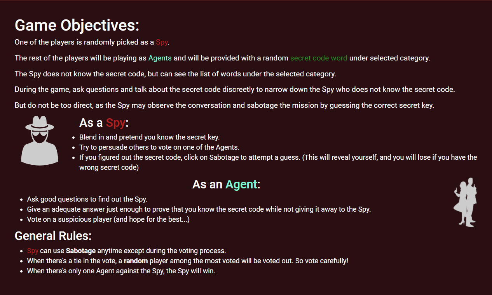

# [Sabotage Game](https://sabotage-chat.herokuapp.com)

Sabotage Game is a chat-based web game in which players try to find out a random spy among themselves.

**Any constructive feedbacks are always welcome and appreciated!**

## Game rule

**Requires at least 3 players**

---

## Development Notes

Please note that this project is for hobby.

- Validations and game-play may not cover some edge cases, so play as intended. (AKA, do not try to "hack")
- It is designed for desktop play, not mobile (yet).
- It is never intended for large traffic.
- socket.io disconnects and reconnects as new socket on refresh. During game-play, a refresh will automatically be considered as being "voted out", so avoid using refresh in-game.

### Todos:

- [x] Chat bubble colors
- [x] Chat spam prevention
- [x] Empty chat prevention
- [x] Input sanitization
- [x] vote, sabotage timer
- [x] Chat characters limit
- [x] Font selection
- [x] Game sounds
- [x] Private Room
- [ ] Display who has voted (and to whom)
- [x] Mobile-friendly UI/UX
- [ ] Show locale time instead of server time
- [x] Better UI for invalid access (instead of simple `alert()`)
    - Decided not to show any error message for invalid access (simply kick out to landing page seems enough)
- [ ] Display dead indicators
- [ ] Penalize wrong vote by excluding some words from the list
- [ ] Some colors to system chat for readability
